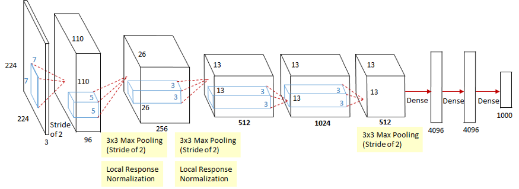

# VGG-Inception-ZFNet-and-ResNet-models
Here, I have implemented VGG16, Inception and ResNet50 models.

## 1) VGG-16 Module
 - VGG stands for Visual Geometry Group,it is an academic group focused on computer vision at Oxford University. VGG netwrok was the runner-up at the ILSVRC-2014 challenge. 
 - The key innovation in this architecture was the definition and repetition of what we will refer to as VGG-blocks. These are groups of convolutional layers that use small filters (e.g. 3×3 pixels) followed by a max pooling layer.
 
 - Following is the architecture of the VGG-16 model. Used in the original paper by __Karen Simonyan__, __Andrew Zisserman__. 
 - Papers Link: [Very Deep Convolutional Networks for Large-Scale Image Recognition](https://arxiv.org/abs/1409.1556)
  

 
## 2) Inception Module
- Inception module was described and used in the GoogleNet module, which won the ILSVRC-2014 challenge.
- The key innovation on the inception model is called the inception module. This is a block of parallel convolutional layers with different sized filters (e.g. 1×1, 3×3, 5×5) and a and 3×3 max pooling layer, the results of which are then concatenated.

- Following is the architecture of the GoogleNet model, in which the Inception module was used.And the authors of the GoogleNet paper are __Christian Szegedy__, __Wei Liu__.
- Papers Link: [Going Deeper with Convolutions](https://arxiv.org/abs/1409.4842)

## 3) ResNet50 Module
- ResNet stands for Residual Network and ResNet won the ILSVRC-2015 challenge.
- A key innovation in the ResNet was the residual module. The residual module, specifically the identity residual model, is a block of two convolutional layers with the same number of filters and a small filter size where the output of the second layer is added with the input to the first convolutional layer. The ResNet model contains Identity block and Convolutional block.
  
- The first one is the identity block and the other is the convolutional block.
- Following is the architecture of the ResNet50 model, and the paper was published by __Kaiming He et.al 2015.
Papers Link: [Deep Residual Learning for Image Recognition](https://arxiv.org/abs/1512.03385)

## 4) ZFNet Module
- ZFNet model won the ILSVRC 2013 challenge.
- The key innovation on the model is the DeConvnet Techniques for Visualization, they run the AlexNet model and fine tuned it while visualizing the changes.
- By visualizing the convolutional network layer by layer, ZFNet adjusts the layer hyperparameters such as filter size or stride of the AlexNet and successfully reduces the error rates.

- The above diagram is the architecture of the ZFNet model.
Papers Link: [Visualizing and Understanding Convolutional Networks](https://arxiv.org/abs/1311.2901)
